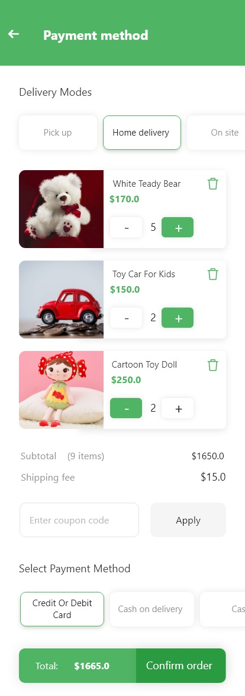

# Abdullah khan - Android Developer

    
Software Engineer as an Android Developer since <strong>more than 1.5yrs</strong>. Developed native and Flutter Android apps ranging from simple education apps to high-end secure enterprise apps. Always working towards clean code, intuitive user experience, data security. I am striving to keep me up with new technologies. 

<h2 id="skills">Skills</h2>

Currently using <strong>Java, Kotlin, Dart</strong>, 2+yrs 
<strong>REST, Firebase, Unit Tests, Retrofit, RxJava, Coroutine, Flow, Room, LiveData, DI(Dagger2, Hilt), MVVM, MVP, Google Maps, Jetpack, Agora, Sinch, Accessibility And Maintenance  Publish android app on playstore</strong> 
<strong>Tools:</strong> GitHub, Bitbucker, Jira, Trello, Skype 

  

  
  # Zawar Passenger (Ride Sharing App)
[Zawar Passenger](https://play.google.com/store/apps/details?id=com.zawar.user&hl=en_US&gl=US) is a online Ride sharing App. The basic requirements for the app were that it help Travel with safety ,share your Ride details with your loved ones, so that they can track your Ride

I'm quite happy with the final product: Zawar was built entirely in Java, with no external dependencies, and the UI—which was created using Different Layout in Interface Builder—is attractive and animates smoothly. Most importantly, the code is clean, easy to reason about, and maintains strong separation of concerns.

<!-- &nbsp;&nbsp;&nbsp;&nbsp;&nbsp;&nbsp;&nbsp;&nbsp;&nbsp;&nbsp;&nbsp;&nbsp;&nbsp;&nbsp;&nbsp;&nbsp;&nbsp;&nbsp;&nbsp;&nbsp;   -->

&nbsp;&nbsp;&nbsp;&nbsp;&nbsp;&nbsp;&nbsp;&nbsp;&nbsp;&nbsp;&nbsp;&nbsp;&nbsp;&nbsp;&nbsp;&nbsp;

  # Zawar Driver (Rider App)
[Zawar Driver](https://play.google.com/store/apps/details?id=com.zawar.driver) is a Ride sharing driver App. This app is for driver to provide services to customers through ride sharing.

&nbsp;&nbsp;&nbsp;&nbsp;&nbsp;&nbsp;&nbsp;&nbsp;&nbsp;&nbsp;&nbsp;&nbsp;&nbsp;&nbsp;&nbsp;&nbsp;

  
  
  # Denarius (Inventory app)
[Denarius](https://apps.apple.com/us/app/hello-doctor-patient/id1502356693?ls=123) is a Online inventory App.

&nbsp;&nbsp;&nbsp;&nbsp;&nbsp;&nbsp;&nbsp;&nbsp;&nbsp;&nbsp;&nbsp;&nbsp;&nbsp;&nbsp;&nbsp;&nbsp;

  
  
      # TH-Auction (fitness app)
[Emadrasa](https://apps.apple.com/us/app/hello-doctor-patient/id1502356693?ls=123) is a Online Animal Auction App.

&nbsp;&nbsp;&nbsp;&nbsp;&nbsp;&nbsp;&nbsp;&nbsp;&nbsp;&nbsp;&nbsp;&nbsp;&nbsp;&nbsp;&nbsp;&nbsp;

      # TH-Auction (fitness app)
[Finding Jobs(RH)](https://apps.apple.com/us/app/hello-doctor-patient/id1502356693?ls=123) is a Online Shoping App.

&nbsp;&nbsp;&nbsp;&nbsp;&nbsp;&nbsp;&nbsp;&nbsp;&nbsp;&nbsp;&nbsp;&nbsp;&nbsp;&nbsp;&nbsp;&nbsp;

  
        # TH-Auction (fitness app)
[Ezelink](https://apps.apple.com/us/app/hello-doctor-patient/id1502356693?ls=123) is a Online Rooms reservation and food delivery App.

&nbsp;&nbsp;&nbsp;&nbsp;&nbsp;&nbsp;&nbsp;&nbsp;&nbsp;&nbsp;&nbsp;&nbsp;&nbsp;&nbsp;&nbsp;&nbsp;

  
  
  
          # TH-Auction (fitness app)
[IDO](https://apps.apple.com/us/app/hello-doctor-patient/id1502356693?ls=123) is a Online Hotel reservation App.

&nbsp;&nbsp;&nbsp;&nbsp;&nbsp;&nbsp;&nbsp;&nbsp;&nbsp;&nbsp;&nbsp;&nbsp;&nbsp;&nbsp;&nbsp;&nbsp;

  
  
            # TH-Auction (fitness app)
[Stop Harassment](https://apps.apple.com/us/app/hello-doctor-patient/id1502356693?ls=123) is a Online Money Transfer App.

&nbsp;&nbsp;&nbsp;&nbsp;&nbsp;&nbsp;&nbsp;&nbsp;&nbsp;&nbsp;&nbsp;&nbsp;&nbsp;&nbsp;&nbsp;&nbsp;

  
  
  
   # QBScanner 
 [QBScanner](https://github.com/salmanafzal25/iOS-Portfolio/blob/master/README.md) is use to scan a QR code or barcode simply open the app, point the camera at the code, and you’re done!

&nbsp;&nbsp;&nbsp;&nbsp;&nbsp;&nbsp;&nbsp;&nbsp;&nbsp;&nbsp;&nbsp;&nbsp;&nbsp;&nbsp;&nbsp;&nbsp;

# Contact Info:

- Email: abdu11ah_k@gmail.com
- LinkedIn: [Salman Afzal](https://www.linkedin.com/in/abdullah-yousafzai)
- Github: [@salmanafzal25](https://github.com/abdullah951/Android-Portfolio.git)
- Stackoverflow: [@salmanafzal25](https://stackoverflow.com/users/6596362/abdullah)
- Whatsapp: +923045192218
