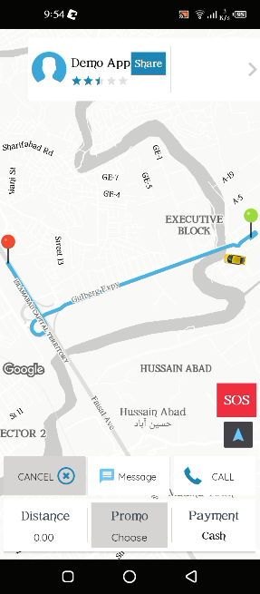

# Abdullah khan - Software Developer

    
Software Engineer as an React Developer solely <strong>improving learning curve every day</strong>. Worked on varius projects from web application and custom business projects for multiple UI designs. Provided new ideas and designs for generartion of user implemented server deployment. I am striving to keep up with new technologies. 

<h2 id="skills">Skills</h2>

Currently using <strong>Javascript, ReactJS, NextJS, NodeJS, ExpressJS</strong><!--, 2+yrs--> 
<strong>REST, Bootstrap, React Bootstrap, ChakraUi, Redux, Zustand, Context API, CSS, SCSS, Node, MongoDB, Mongoose, Firebase, Mysql, Maps, Virtual DOM, JSX, Unit Tests, Forms, Git, Github, GitLab</strong> 
<strong>Tools:</strong> GitHub, Bitbucker, Jira, Trello, Skype 

  

  
  # The Fit Club (Fitness Center)
[The Fitness Club] is a online Fitness center website. The basic requirements for the app were that it help people to motivate and join the healthy routine which every one crave to follow.

I'm quite happy with the final product: The Fitness Clut was built entirely in Reactjs and the UI—which was created using Different Layout in Interface Builder—is attractive and animates smoothly. Most importantly, the code is clean, easy to reason about, and maintains strong separation of concerns.

<!-- &nbsp;&nbsp;&nbsp;&nbsp;&nbsp;&nbsp;&nbsp;&nbsp;&nbsp;&nbsp;&nbsp;&nbsp;&nbsp;&nbsp;&nbsp;&nbsp;&nbsp;&nbsp;&nbsp;&nbsp;   -->

&nbsp;&nbsp;&nbsp;&nbsp;&nbsp;&nbsp;&nbsp;&nbsp;&nbsp;&nbsp;&nbsp;&nbsp;&nbsp;&nbsp;&nbsp;&nbsp;

  
  
  # Fooditel (Food Delivery Website)
[Fooditel] is a online Food delivery system. The basic motivation to develop this website was to ease the customers who want to enjoy their lesuire time with their families in home and still enjoy the best food in around their area.

Varius technologies were used in the development of fooditel. The key technologies used to develop this application are Nextjs, Sanity, Zustand. For payment method Stripe is used.

<!-- &nbsp;&nbsp;&nbsp;&nbsp;&nbsp;&nbsp;&nbsp;&nbsp;&nbsp;&nbsp;&nbsp;&nbsp;&nbsp;&nbsp;&nbsp;&nbsp;&nbsp;&nbsp;&nbsp;&nbsp;   -->

&nbsp;&nbsp;&nbsp;&nbsp;&nbsp;&nbsp;&nbsp;&nbsp;&nbsp;&nbsp;&nbsp;&nbsp;&nbsp;&nbsp;&nbsp;&nbsp;

  
  
  # Zawar Passenger (Ride Sharing App)
[Zawar Passenger](https://play.google.com/store/apps/details?id=com.zawar.user&hl=en_US&gl=US) is a online Ride sharing App. The basic requirements for the app were that it help Travel with safety ,share your Ride details with your loved ones, so that they can track your Ride

I'm quite happy with the final product: Zawar was built entirely in Java, with no external dependencies, and the UI—which was created using Different Layout in Interface Builder—is attractive and animates smoothly. Most importantly, the code is clean, easy to reason about, and maintains strong separation of concerns.

<!-- &nbsp;&nbsp;&nbsp;&nbsp;&nbsp;&nbsp;&nbsp;&nbsp;&nbsp;&nbsp;&nbsp;&nbsp;&nbsp;&nbsp;&nbsp;&nbsp;&nbsp;&nbsp;&nbsp;&nbsp;   -->

&nbsp;&nbsp;&nbsp;&nbsp;&nbsp;&nbsp;&nbsp;&nbsp;&nbsp;&nbsp;&nbsp;&nbsp;&nbsp;&nbsp;&nbsp;&nbsp;

  # Zawar Driver (Rider App)
[Zawar Driver](https://play.google.com/store/apps/details?id=com.zawar.driver) is a Ride sharing driver App. This app is for driver to provide services to customers through ride sharing.

&nbsp;&nbsp;&nbsp;&nbsp;&nbsp;&nbsp;&nbsp;&nbsp;&nbsp;&nbsp;&nbsp;&nbsp;&nbsp;&nbsp;&nbsp;&nbsp;

  
  
  # Denarius (Inventory app)
[Denarius](https://apps.apple.com/us/app/hello-doctor-patient/id1502356693?ls=123) is a Online inventory App.

&nbsp;&nbsp;&nbsp;&nbsp;&nbsp;&nbsp;&nbsp;&nbsp;&nbsp;&nbsp;&nbsp;&nbsp;&nbsp;&nbsp;&nbsp;&nbsp;

  
  
   # TH-Auction (Management app)
[Emadrasa](https://apps.apple.com/us/app/hello-doctor-patient/id1502356693?ls=123) is a School Inventory System to manage and keep update of student records in organination.

&nbsp;&nbsp;&nbsp;&nbsp;&nbsp;&nbsp;&nbsp;&nbsp;&nbsp;&nbsp;&nbsp;&nbsp;&nbsp;&nbsp;&nbsp;&nbsp;

      # TH-Auction (fitness app)
[Finding Jobs(RH)](https://apps.apple.com/us/app/hello-doctor-patient/id1502356693?ls=123) is a Online Order placing App for Property Maintenance Staff to provide inventry for manintenace related work.

&nbsp;&nbsp;&nbsp;&nbsp;&nbsp;&nbsp;&nbsp;&nbsp;&nbsp;&nbsp;&nbsp;&nbsp;&nbsp;&nbsp;&nbsp;&nbsp;

  
        # TH-Auction (fitness app)
[Ezelink](https://apps.apple.com/us/app/hello-doctor-patient/id1502356693?ls=123) is a bulit for Internet Provider Company to give free internet for a specific period of to facilitate them with free internet. 

&nbsp;&nbsp;&nbsp;&nbsp;&nbsp;&nbsp;&nbsp;&nbsp;&nbsp;&nbsp;&nbsp;&nbsp;&nbsp;&nbsp;&nbsp;&nbsp;

  
  
  
          # TH-Auction (fitness app)
[IDO](https://apps.apple.com/us/app/hello-doctor-patient/id1502356693?ls=123) is a Online Inventory reservation App.

&nbsp;&nbsp;&nbsp;&nbsp;&nbsp;&nbsp;&nbsp;&nbsp;&nbsp;&nbsp;&nbsp;&nbsp;&nbsp;&nbsp;&nbsp;&nbsp;

  
  
   # Stop Racisme
[Stop Racisme](https://github.com/abdullah951/StopHarasment) is an internet and mobile platform made available to the public to report incidents in public spaces.

<!-- 

&nbsp;&nbsp;&nbsp;&nbsp;&nbsp;&nbsp;&nbsp;&nbsp;&nbsp;&nbsp;&nbsp;&nbsp;&nbsp;&nbsp;&nbsp;&nbsp;

-->
  
  
  
   # QBScanner 
 [QBScanner](https://github.com/abdullah951/barcode) is use to scan a QR code or barcode to recognize counterfit product. If the product is fake the app shows red warning.

<!--

&nbsp;&nbsp;&nbsp;&nbsp;&nbsp;&nbsp;&nbsp;&nbsp;&nbsp;&nbsp;&nbsp;&nbsp;&nbsp;&nbsp;&nbsp;&nbsp;

 -->

# Contact Info:

- Email: abdu11ah951@outlook.com
- LinkedIn: [Abdullah khan](https://www.linkedin.com/in/abdullah-yousafzai)
- Github: [@abdullah951](https://github.com/abdullah951/Android-Portfolio.git)
- Stackoverflow: [@abdullah](https://stackoverflow.com/users/6596362/abdullah)
- Twitter: [@abdullah951](https://twitter.com/abdu11ah951)
- Whatsapp: +92 314 5243224
